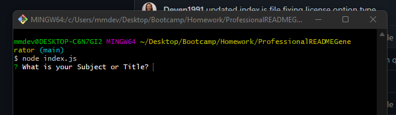
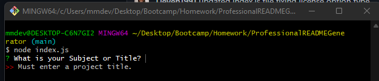
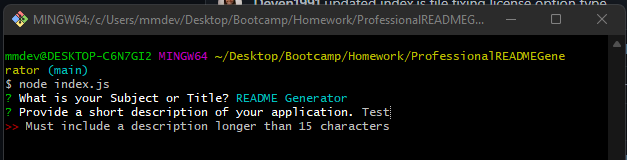
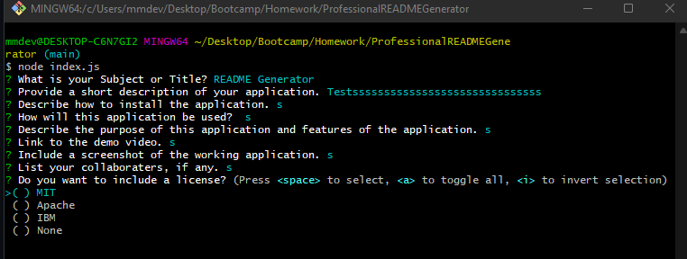
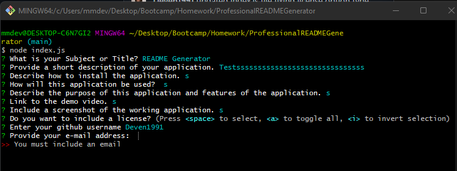

# Professional README Generator


## Description

This webpage is a command-line application that dynamically generates a professional README.md file from a user's input using the [Inquirer package](https://www.npmjs.com/package/inquirer).

- This application allows a user to quickly and easily create a README file by using a command-line application to generate one.

- This allows the user to devote more time to working on the project versus spending time creating a high-quality README file.


## Table of Contents

If your README is long, add a table of contents to make it easy for users to find what they need.

- [Installation](#installation)
- [Usage](#usage)
- [Credits](#credits)
- [License](#license)
- [Features](#features)
- [Tests](#tests)


## Installation

The application is invoked by using the following command:

```bash
node index.js
```


## Usage

Once the application is invoked, the user is asked a series of questions in order to generate MD file.

First question refers to subject or title and validation confirms input of any length greater than 0 is input.



Next, the description of the README must be at least 15 characters long.



Once prompted to select a license, user is given choices between "MIT," "Apache," "IBM," or "None."



Next question asks user to type GitHub username which cannot be less than four characters.

Last question with validation confirms user's e-mail is at least 1 or more characters.



When the user clicks on the links in the Table of Contents, the user is taken to the corresponding section of the README.

Link to walkthrough video that demonstrates the functionality of the README generator: <<INSERT LINK>>

## Credits

Referenced the [Professional README Guide](https://coding-boot-camp.github.io/full-stack/github/professional-readme-guide) in order to include everything that a high-quality, professional README should contain.


## License

Refered to [https://choosealicense.com/](https://choosealicense.com/) for choosing licenses.

- Apache - https://choosealicense.com/licenses/apache-2.0/
- IBM - https://opensource.org/licenses/IPL-1.0
- MIT - https://choosealicense.com/licenses/mit/


## Features

Application uses package.json - a file that exists at the root and holds metadata relevant to the project. It is used for managing the project's dependencies, scripts, and version.


## Tests

A sample README-Generated using the application is displayed below.

    ```md

    

    ```
